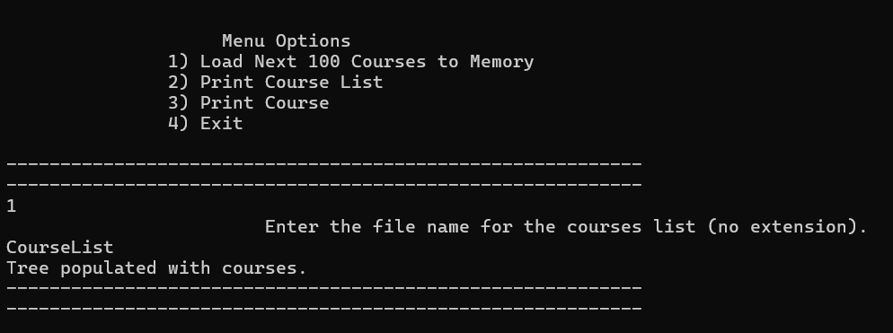
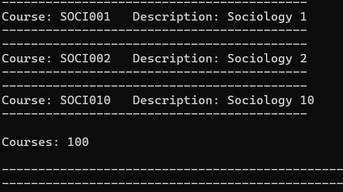
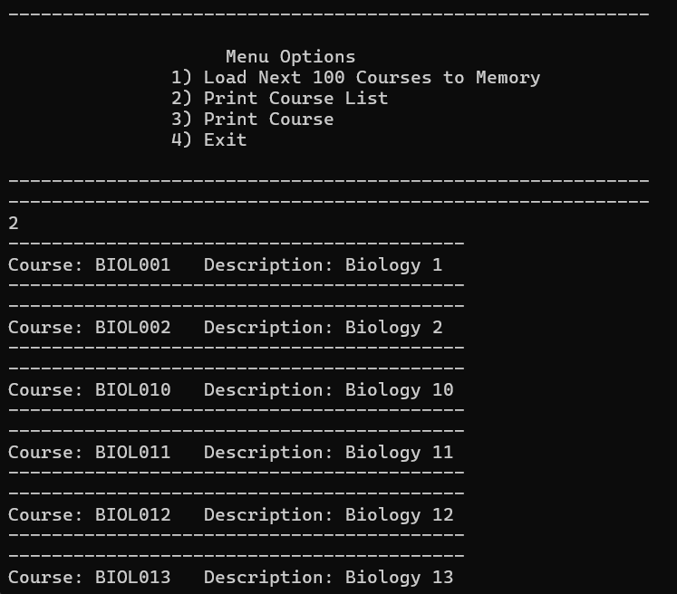
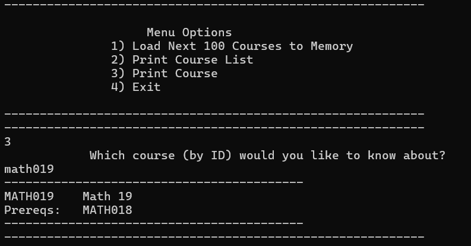

# CS300_Enhancement2

About the Project/Project Title
ABCU Course App is a C++ application designed to manage a Binary Search Tree (BST) of university courses. It allows users to load course data from a file, print all courses in sorted order, display details of a specific course by ID, and validate course prerequisites, in effect, handling all operations for maintaining a list of courses.

Motivation
Managing course data, including prerequisites, is critical for academic advisors and students at ABCU. Manually verifying course details and prerequisites is time-consuming and error-prone. This application automates the process by organizing courses in a BST, enabling fast retrieval and validation of course information, thus saving time and ensuring data integrity.

Getting Started
To get started, follow the steps below:
Ensure a C++ compiler is installed (see Installation).

Compile the provided C++ files (ABCUApp.cpp, BST.cpp, ABCUApp.hpp, BST.hpp) using a C++ compiler.

Place the course data file (CourseList.txt) in the same directory as the executable.

Run the compiled executable to launch the ABCU Course App.

Use the interactive menu to:
Load up to 100 courses from a file into the BST (Option 1).

Also notes the number of courses in memory.

Print all courses in alphabetical order by course ID (Option 2).

Print details of a specific course by entering its ID (Option 3).

Exit the program (Option 4).

Installation

To set up the environment:
Install a C++ compiler by following the instructions at GCC Installation.

Ensure the C++ Standard Library is available, as the project uses features like string, vector, etc.

Download or clone the project files to a local directory.

Compile the project using a command like:
bash

g++ ABCUApp.cpp BST.cpp -o ABCUCourseApp

Ensure the course data file (CourseList.txt) is in the same directory as the executable. The file should be a comma-separated text file with each line containing a course ID, course name, and optional prerequisite IDs.

Usage
The ABCU Course App supports three primary use cases:
Load Courses: Reads up to 100 courses from a specified text file into a BST, validating course IDs, names, and prerequisites. IMPORTANT - all prerequsites must exist as a courseID in first column or it is invalid and the file is not read.

Print All Courses: Displays all courses in the BST in alphabetical order by course ID, including course names (descriptions).

Print Single Course: Retrieves and displays details of a specific course, including its ID, name, and prerequisites, based on a user-provided course ID.

Code Example

Example A: Load Courses from File
The BuildStructureFromFile function prompts the user for a file name (without extension), appends .txt, and loads course data into the BST. Exampe C++:

void BuildStructureFromFile(std::string &filePath, BST::BinarySearchTree &tree)
{

    if (filePath.size() < 1 || !std::filesystem::exists(filePath))
    {
        std::string message = "            Enter the file name for the courses list (no extension).";
        std::string userInput = "";

        GetUserString(message, &userInput);

        if (userInput.size() < 1)
        {
            std::cout << "Improper filename. Please try again." << std::endl;
            return;
        }
        userInput += ".txt";
        filePath = userInput;
    }

    // Attempt to read course data from the default file "CourseList.txt".
    bool isRead = ReadCourseFile(filePath, &tree);

    if (isRead)
    {
        std::cout << "Tree populated with courses." << std::endl;
    }
    else
    {
        std::cout << "Tree failed to populate with courses." << std::endl;
        tree.Clear(); // Clear tree on failure to maintain consistency.
    }
}

This reads from a file (e.g., CourseList.txt), parses each line into a Course object, and inserts it into the BST if the course ID is unique and prerequisites are valid and name and id are within appropriate lengths.

Example B: Print All Courses
The PrintCoursesInOrder function performs an in-order traversal of the BST to display all courses. Example C++:

void PrintCoursesInOrder(BST::BinarySearchTree &tree)
{
    if (tree.GetSize() == 0)
    {
        std::cout << "No courses found." << std::endl;
    }
    else
    {
        tree.PrintOrdered(); // Print courses in sorted order.
        std::cout << "" << std::endl;
        std::cout << "Courses: " << tree.GetSize() << std::endl;
        std::cout << "" << std::endl;
    }
}

Checks size of tree and proceeds to print message or courses.

Example C: Print a Single Course  
The `PrintOneCourse` function prompts the user for a course ID and displays its details.

void PrintOneCourse(BST::BinarySearchTree &tree)
{
    std::string message = "Which course (by ID) would you like to know about?";
    std::string userinput;

    // Prompt user for course ID and print course details.
    GetUserString(message, &userinput);
    tree.PrintSingleCourse(userinput);
}

Contact
Shannon Musgrave
shannon.musgrave@snhu.edu (mailto:shannon.musgrave@snhu.edu)
